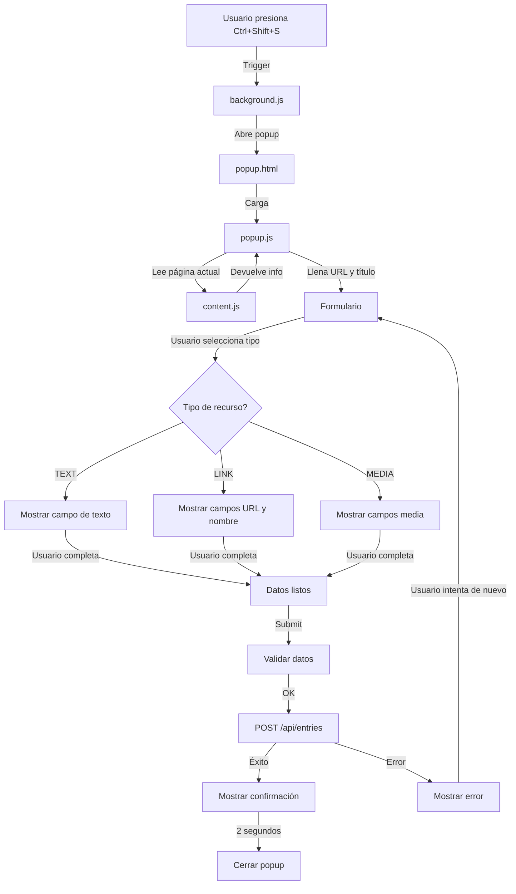

# 🔧 Guía de Desarrollo - PISITO Chrome Extension

## Requisitos

- Chrome o Chromium (versión 88+)
- Un editor de código (VS Code recomendado)
- Node.js (opcional, para herramientas de build)

## Estructura de carpetas

```
chrome-extension/
├── manifest.json              # Configuración de la extensión
├── popup.html                 # Interfaz principal del popup
├── popup.js                   # Lógica del popup
├── options.html               # Página de configuración
├── options.js                 # Lógica de opciones
├── README.md                  # Instrucciones de uso
├── DEVELOPMENT.md             # Este archivo
├── src/
│   ├── background.js          # Service worker
│   ├── content.js             # Script que corre en cada página
├── styles/
│   └── popup.css              # Estilos del popup
└── icons/
    └── icon-128.png           # Icono SVG de la extensión
```

## Flujo de la aplicación



## Cómo funcionan los componentes

### `manifest.json`
Define la extensión, sus permisos, atajos de teclado y scripts que se cargan.

- **permissions**: `activeTab` (acceder a la pestaña actual), `scripting`, `storage`
- **host_permissions**: Acceso a todas las URLs
- **commands**: Define `open-popup` con atajo `Ctrl+Shift+S`
- **action**: Define el popup que se muestra

### `popup.html` & `popup.js`
El popup es la interfaz principal. Se abre cuando:
1. El usuario presiona `Ctrl+Shift+S`
2. El usuario hace clic en el icono de la extensión

El `popup.js` maneja:
- Cargar información de la página actual (URL, título)
- Mostrar/ocultar secciones según el tipo de recurso seleccionado
- Validar el formulario
- Enviar datos a la API

### `src/background.js`
El Service Worker que maneja eventos globales:
- Escucha el comando `open-popup` y abre el popup
- Gestiona la extensión en segundo plano
- Inicializa configuración por defecto

### `src/content.js`
Script que se inyecta en TODAS las páginas web:
- Recopila información de la página (título, URL, texto seleccionado)
- Comunica con popup.js si es necesario
- Base para futuras características de captura

### `options.html` & `options.js`
Página de configuración donde el usuario puede:
- Cambiar la URL de la API
- Guardarse en `chrome.storage.sync`

## Desarrollo local

### 1. Cargar la extensión en Chrome

1. Abre `chrome://extensions/`
2. Activa **Modo de desarrollador** (esquina superior derecha)
3. Click en **"Cargar extensión sin empaquetar"**
4. Selecciona la carpeta `chrome-extension`

### 2. Hacer cambios

Edita los archivos normalmente. Para que los cambios se vean:
- **Para cambios en popup.html/js/css**: Cierra el popup y abre uno nuevo
- **Para cambios en background.js**: Recarga la extensión en `chrome://extensions/`
- **Para cambios en content.js**: Recarga la página web

### 3. Debug

Abre las DevTools:
- `Ctrl+Shift+I` (o Cmd+Option+I en Mac) para ver la consola del popup
- Click derecho → Inspeccionar para ver la página

Para debug del background.js:
1. Ve a `chrome://extensions/`
2. Busca tu extensión
3. Click en "Inspeccionar vistas"
4. Selecciona "Service Worker"

## Testing manual

### Test 1: Atajo de teclado
- [ ] Abre cualquier página (ej: google.com)
- [ ] Presiona `Ctrl+Shift+S`
- [ ] El popup debe abrirse
- [ ] URL y título deben estar prefillados

### Test 2: Crear TEXT entry
- [ ] Abre el popup
- [ ] Selecciona "📄 Texto"
- [ ] Escribe contenido
- [ ] Escribe un título
- [ ] Click "Crear Entry"
- [ ] Spinner debe aparecer
- [ ] Mensaje de éxito debe mostrar

### Test 3: Crear LINK entry
- [ ] Abre `youtube.com`
- [ ] Presiona `Ctrl+Shift+S`
- [ ] Selecciona "🔗 Enlace"
- [ ] URL debe venir prefillada
- [ ] Escribe nombre del enlace
- [ ] Escribe título
- [ ] Valida que enviou correctamente

### Test 4: Configurar API
- [ ] Click derecho en icono de extensión
- [ ] Selecciona "Opciones"
- [ ] Cambia la URL
- [ ] Click "Guardar"
- [ ] Se debe ver mensaje de éxito
- [ ] Recarga, verifica que se guardó

## Mejoras futuras

### Alta prioridad
- [ ] Capturar texto seleccionado automáticamente
- [ ] Captura de screenshots
- [ ] Arrastrar y soltar archivos
- [ ] Upload de archivos locales

### Media prioridad
- [ ] Historial de entries creadas en la sesión
- [ ] Sincronización con otros dispositivos
- [ ] Temas oscuro/claro
- [ ] Soporte multi-idioma

### Baja prioridad
- [ ] Integración con campos de búsqueda
- [ ] Atajos personalizables vía UI
- [ ] Analytics básico
- [ ] Notificaciones push

## Troubleshooting

### El popup no se abre con el atajo
- Verifica que la extensión esté habilitada en `chrome://extensions/`
- Algunos sitios pueden bloquear el atajo (ej: redes sociales)
- Intenta recargando la extensión

### Errores CORS
- Asegúrate que tu API tenga configurado CORS correctamente
- Revisa la consola (F12) para ver el error exacto
- Verifica la URL en opciones

### Cambios no se ven
- Recarga la extensión en `chrome://extensions/`
- Para popup: Cierra el popup y abre uno nuevo
- Para páginas: Presiona F5 para recargar

### API retorna 404
- Verifica que tu servidor esté corriendo
- Revisa la URL en opciones (debe ser sin trailing slash)
- Confirma que el endpoint es `/api/entries`

## Comandos útiles

```bash
# Ver logs en tiempo real (macOS)
log stream --predicate 'eventMessage contains "Chrome"' --level debug

# Compilar si usas TypeScript (opcional)
npx tsc

# Linter (opcional)
npx eslint src/*.js popup.js
```

## Recursos

- [Chrome Extension Docs](https://developer.chrome.com/docs/extensions/)
- [Manifest V3 Migration](https://developer.chrome.com/docs/extensions/mv3/)
- [Chrome Storage API](https://developer.chrome.com/docs/extensions/reference/storage.html)
- [Message Passing](https://developer.chrome.com/docs/extensions/mv3/messaging/)

---

¿Ayuda? Revisa `README.md` para instrucciones de usuario o verifica los logs en DevTools.
